# Guía de juego

Qué es cada cosa, para qué sirve y en qué orden construirla. Todos los números
salen del código: `data/buildings/*.tres` y `scripts/services/GameConfig.gd`.

---

## 1. Qué es esto

Levantas una base en una isla generada al azar y la haces crecer a través de **tres
eras económicas** hasta la Victoria Imperial. No hay prisa impuesta: la presión
viene de que tu gente come, cobra y se desmoraliza si no le llega.

El bucle es: **produce recursos → gasta en edificios → desbloquea la siguiente era
→ repite**, con un ejército al final que sale a pelear por turnos.

---

## 2. Controles

| Acción | Ratón y teclado | Táctil |
|---|---|---|
| Mover la cámara | `WASD` o arrastrar con el botón central | Arrastrar un dedo |
| Zoom | Rueda del ratón | Pellizcar con dos dedos |
| Construir | Botón `CONSTRUIR` abajo | Igual |
| Rotar el edificio antes de colocarlo | `R` | Botón de rotar |
| Abrir menús | Botón `☰` arriba a la derecha | Igual |
| Cerrar un panel | `ESC` | Botón `X` |

---

## 3. Los cuatro recursos

| Recurso | Para qué | Empiezas con | Se desbloquea |
|---|---|---|---|
| **Oro** | Moneda universal. Todo cuesta oro, y tu gente cobra sueldo | 300 | Era 1 |
| **Madera** | Construcción, y tu gente la quema para calentarse | 200 | Era 1 |
| **Acero** | Construcción avanzada y unidades | 0 | Era 2 — al construir la Fundición |
| **Petróleo** | Construcción de final de partida | 0 | Era 3 — al construir la Refinería |

**Tope de almacenamiento: 800**, más 400 por cada Almacén (máximo 5). Lo que produzcas
por encima del tope se pierde.

Los yacimientos de la isla se ven desde el principio, pero **no puedes explotarlos
hasta que su recurso esté desbloqueado**.

---

## 4. La gente: población, trabajadores y moral

Es el sistema que más gente pasa por alto y el que te mata la partida.

**Población.** Empiezas con 5. Crece sola si hay casas libres y la moral está por
encima de 30. Cada casa da +6 de capacidad; el Núcleo da 5.

**Trabajadores.** Casi todo edificio que produce necesita gente. Si no hay
trabajadores libres, **el edificio se queda parado** y te lo avisa con un cartel rojo
encima. Construir una fábrica sin gente que la atienda no sirve de nada.

**Consumo.** Cada persona come **1 madera y 1 oro** por ciclo. Con 20 habitantes son
20 de cada uno por ciclo. Si no puedes pagarlo, **la moral se desploma**.

**Moral (0-100).** Empieza en 75 y multiplica tu producción:

| Moral | Producción |
|---|---|
| 0 | ×0,5 |
| 50 | ×1,0 |
| 100 | ×1,2 |

Por debajo de **30** la población deja de crecer. Por debajo de **20** salta el aviso
de peligro. La moral sube sola si pagas el consumo, y las decoraciones la recuperan
pasivamente.

> **La trampa clásica:** construyes muchas fábricas, la población crece para
> atenderlas, el consumo se dispara, no llegas a pagarlo y la moral cae — lo que baja
> la producción, lo que hace que llegues aún menos. Es una espiral. **Cuando crezcas,
> crece primero la madera.**

---

## 5. Catálogo de edificios

Los 14 edificios del juego. Las imágenes son los modelos reales del juego.

### Producen recursos

| | Edificio | Tamaño | Coste | Gente | Produce |
|---|---|---|---|---|---|
| 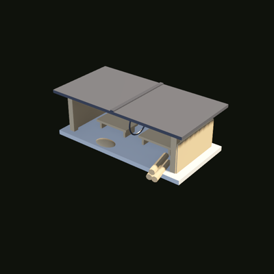 | **Aserradero** | 2×1 | 80 oro · 50 madera | 2 | 6 madera / 12s |
| 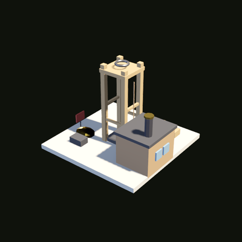 | **Mina de oro** | 2×2 | 120 oro · 80 madera | 3 | 8 oro / 12s |
| 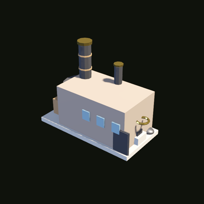 | **Fundición** | 2×1 | 200 oro · 120 madera | 3 | 5 acero / 15s |
| 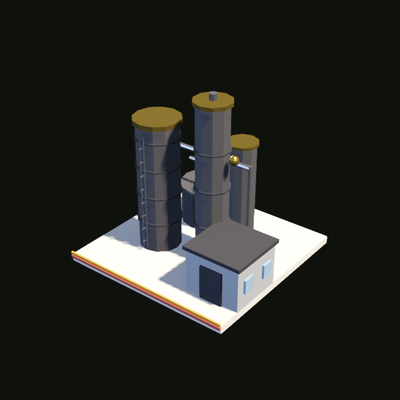 | **Refinería** | 2×2 | 300 oro · 150 acero · 100 madera | 4 | 4 petróleo / 18s |

**La Fundición desbloquea el acero y la era 2. La Refinería desbloquea el petróleo y
la era 3.** Por eso ninguna de las dos cuesta el recurso que desbloquea.

> ⚠️ **La Refinería solo se puede colocar encima de un pozo de petróleo.** Es el único
> edificio con esa restricción. Si no encuentras un pozo en tu isla, no hay era 3.

### Sostienen la base

| | Edificio | Tamaño | Coste | Gente | Qué hace |
|---|---|---|---|---|---|
| 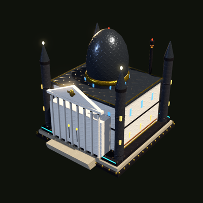 | **Núcleo** | 3×3 | — | 0 | Tu punto de partida. +5 de población. No se puede demoler |
| 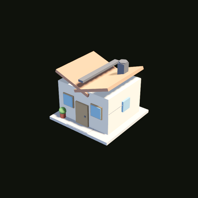 | **Casa** | 1×1 | 50 oro · 30 madera | 0 | +6 de capacidad de población. Máximo 10 |
| 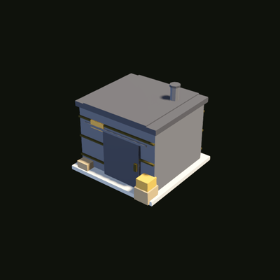 | **Almacén** | 1×1 | 60 oro · 40 madera | 1 | +400 de tope de almacenamiento. Máximo 5 |

### Militares

| | Edificio | Tamaño | Coste | Gente | Qué hace |
|---|---|---|---|---|---|
| 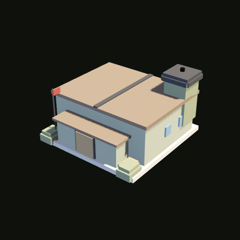 | **Cuartel** | 2×2 | 250 oro · 100 acero · 80 madera | 3 | Entrena unidades. Cada cuartel es una plaza de entrenamiento en paralelo |
| 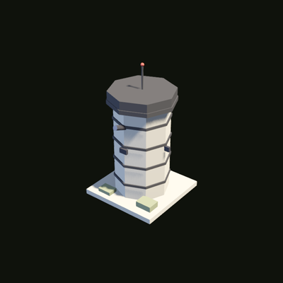 | **Torre** | 1×1 | 150 oro · 60 acero · 20 petróleo · 30 madera | 1 | **Hoy no hace nada** salvo contar para un hito. Su comportamiento defensivo está por construir |
| 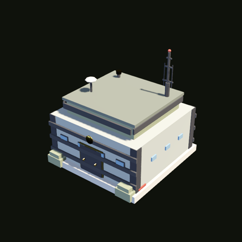 | **Cuartel General** | 2×2 | 500 oro · 300 acero · 200 petróleo · 200 madera | 5 | 10 oro / 20s. **Subirlo a nivel 3 es ganar la partida.** Solo uno |

### Decoraciones (suben la moral)

| | Edificio | Coste | Moral |
|---|---|---|---|
| 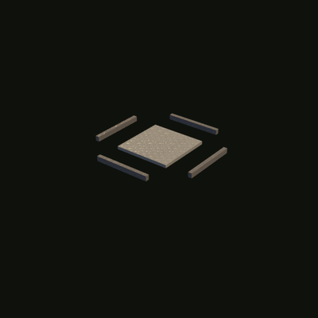 | **Carretera** | 10 oro · 5 madera | +2 |
| 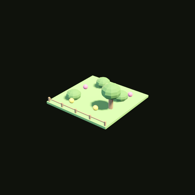 | **Jardín** | 30 oro · 20 madera | +5 |
| 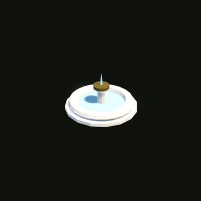 | **Fuente** | 60 oro · 20 acero · 10 madera | +7 |
| 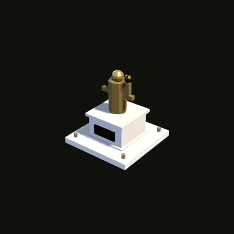 | **Estatua** | 120 oro · 40 acero | +10 |

Las decoraciones no dan moral de golpe: **aceleran su recuperación** (+1 por cada 10
puntos de bonus, por ciclo). No arreglan una base que no puede pagar el consumo;
ayudan a una base que sí puede.

### Qué necesitas antes de poder construir cada cosa

| Edificio | Requiere tener |
|---|---|
| Fundición | Aserradero |
| Cuartel | Fundición + Aserradero |
| Refinería | Fundición |
| Torre | Cuartel |
| Cuartel General | Cuartel + Refinería |

### Límites

Aserradero 5 · Mina de oro 4 · Fundición 3 · Refinería 2 · Almacén 5 · Cuartel 3 ·
Torre 6 · Casa 10 · Estatua 5 · Fuente 5 · **Cuartel General 1** · Jardín y
carretera sin límite.

---

## 6. Los procesos manuales

Además de producir sola, casi cada fábrica tiene **recetas que lanzas a mano** desde
su panel. Conviertes unos recursos en otros con margen. Es la forma de desatascarte
cuando te falta algo concreto.

| Dónde | Receta | Metes | Sacas | Tarda |
|---|---|---|---|---|
| Núcleo | Tablones | 20 madera | 35 madera | 30s |
| Núcleo | Chapa de hierro | 20 acero | 30 acero | 45s |
| Núcleo | **Tuberías** | 15 acero · 10 madera | **60 oro** | 60s |
| Aserradero | Madera refinada | 15 madera | 25 madera · 5 oro | 30s |
| Aserradero | **Carbón vegetal** | 25 madera | **12 acero** | 25s |
| Mina de oro | Minería profunda | 10 acero | 35 oro | 35s |
| Mina de oro | Extracción de gemas | 20 oro · 5 acero | 60 oro | 60s |
| Fundición | Aleación | 20 acero · 10 madera | 45 acero | 40s |
| Fundición | Placas de blindaje | 30 acero | 15 acero · 20 oro | 45s |
| Refinería | Destilación | 15 petróleo | 25 petróleo | 30s |
| Refinería | Procesado químico | 20 petróleo · 10 acero | 18 petróleo · 25 oro | 50s |

> **Dos que conviene conocer:** el **carbón vegetal** del aserradero te da acero sin
> tener Fundición, y las **tuberías** del núcleo son la mejor conversión a oro del
> juego.

---

## 7. El mercado — la Bolsa Imperial

Compras y vendes madera, acero y petróleo **a cambio de oro**. El oro no se compra:
es la moneda.

Los precios flotan. Base: madera 3, acero 8, petróleo 12 oro por unidad, con un
**30% de diferencia entre lo que pagas al comprar y lo que cobras al vender**.
Comprar sube el precio, vender lo baja, y con el tiempo vuelve a su sitio. Se mueve
entre ×0,5 y ×2,5 del precio base.

**Hacer 10 operaciones desbloquea el hito Mercader.**

---

## 8. La tecnología

15 tecnologías en 3 ramas (Industrial, Militar y Logística), 5 niveles cada una en
línea: para la tercera necesitas la segunda.

Cuestan **recursos** y tiempo, y **solo puedes investigar una a la vez**. Los bonos
son permanentes: más producción, más almacenamiento, menos consumo, mejor moral o
construcción más rápida.

---

## 9. El ejército y el combate

El Cuartel entrena tres tipos de unidad. **Cada cuartel entrena una unidad a la vez**;
si quieres dos en paralelo, necesitas dos cuarteles.

| Unidad | Era | Coste | Tarda | Sueldo | Poder |
|---|---|---|---|---|---|
| **Infantería** | 1 | 40 oro · 20 madera | 20s | 1 oro | 10 |
| **Artillería** | 2 | 80 oro · 30 acero | 35s | 2 oro | 28 |
| **Vehículo** | 3 | 140 oro · 60 acero · 30 petróleo | 55s | 4 oro | 65 |

**Capacidad del ejército: 3 + 8 por cada cuartel.** Las unidades entrenándose también
ocupan plaza.

> ⚠️ **El sueldo se cobra cada 30 segundos, solo en oro.** Si no te llega, te vacía el
> oro que tengas y te avisa. Las unidades no desertan todavía, pero un ejército grande
> sin economía detrás te deja sin oro para todo lo demás.

### En el tablero

El combate es por turnos en un tablero **8×8**, hasta **6 unidades por bando**.

| | Vida | Ataque | Defensa | Movimiento | Alcance | Iniciativa |
|---|---|---|---|---|---|---|
| Infantería | 30 | 8 | 2 | 3 | 1 | 5 |
| Artillería | 22 | 14 | 1 | 1 | **2 a 3** | 3 |
| Vehículo | 60 | 12 | 5 | 4 | 1 | 4 |

Reglas que hay que saber:
- **Una unidad puede moverse y luego atacar**, pero no moverse dos veces. Atacar
  termina su turno.
- **La artillería no puede disparar a un enemigo pegado a ella** (alcance mínimo 2).
  Si dejas que se te acerquen, no sirve.
- **Defender duplica la defensa** hasta tu siguiente turno.
- **El orden lo marca la iniciativa**, y **tu moral la modifica**: con la moral al
  máximo tus unidades actúan antes y pegan un 15% más fuerte; con la moral por los
  suelos, al revés.
- Si se agotan las 20 rondas, **gana quien tenga más vida total sumada. El empate lo
  pierdes tú.**

> **La moral de tu ciudad se captura al empezar la batalla y no cambia durante ella.**
> Sales a pelear con el ánimo que tenía tu pueblo al despedirte.

---

## 10. El camino a la victoria

Nueve hitos. El último es ganar.

| # | Hito | Cómo se consigue |
|---|---|---|
| 1 | Pionero | Construir el primer Aserradero |
| 2 | Prospector | Construir la primera Mina de oro |
| 3 | Acumulador | Construir el primer Almacén |
| 4 | Industrial | Construir la Fundición → **era 2** |
| 5 | Barón del petróleo | Construir la Refinería → **era 3** |
| 6 | Mercader | Completar 10 operaciones de mercado |
| 7 | Comandante | Tener 1 Cuartel y 2 Torres |
| 8 | General | Construir el Cuartel General |
| 9 | **Victoria Imperial** | **Subir el Cuartel General a nivel 3** |

Subir el Cuartel General cuesta aparte:

| Nivel | Coste |
|---|---|
| 2 | 800 oro · 500 acero · 300 petróleo · 400 madera |
| 3 | 1.500 oro · 800 acero · 500 petróleo · 700 madera |

### Orden recomendado, paso a paso

1. **Aserradero** — lo primero, siempre. Sin madera no hay nada, y todo lo que sigue la cuesta.
2. **Una o dos casas** — necesitas gente para atender lo que construyas.
3. **Mina de oro** — ya tienes ingreso de los dos recursos de la era 1.
4. **Segundo aserradero** — el consumo empieza a doler; adelántate.
5. **Almacén** — ⚠️ ojo, lee la nota de abajo antes de ponerlo.
6. **Fundición** — entras en la era 2 y se desbloquea el acero.
7. **Más casas y alguna decoración** — estabiliza la moral antes de la siguiente tanda.
8. **Cuartel** — abre el ejército y las escaramuzas.
9. **Refinería, encima de un pozo** — era 3, petróleo.
10. **Dos Torres** — cierran el hito Comandante.
11. **Cuartel General** — y a partir de aquí solo acumulas para las dos subidas.
12. **HQ nivel 2 → nivel 3** — victoria.

Por el camino, **10 operaciones de mercado** en cualquier momento.

---

## 11. Las cuatro fases (qué se enciende y cuándo)

Esto no se ve en pantalla pero gobierna toda la dificultad. El juego se endurece por
tramos, y **cada tramo lo activas tú al construir algo**.

| Fase | La activa | Qué cambia |
|---|---|---|
| **Fundación** | Inicio | **Ni consumo ni crecimiento.** Construyes libre, sin presión |
| **Asentamiento** | Primer **Aserradero** | Empieza el consumo, pero suave: cada 60s. La moral todavía no se aplica |
| **Economía** | Primera **Mina de oro** | **La moral empieza a contar de verdad** |
| **Supervivencia** | Primer **Almacén** | Consumo cada 30s, castigo de moral de −3 a **−8**, y **empiezan los eventos aleatorios** |
| **Expansión** | **Fundición** (era 2) | Ritmo completo |

> ⚠️ **El Almacén es el interruptor de la dificultad.** Es el edificio más barato de la
> lista y parece inofensivo, pero al colocarlo **duplicas la frecuencia del consumo,
> casi triplicas el castigo de moral y despiertas los eventos aleatorios**. No lo
> pongas hasta tener dos aserraderos y una mina funcionando.

### Eventos aleatorios

A partir de Supervivencia, cada 2-5 minutos pasa algo:

| Evento | Efecto |
|---|---|
| Tormenta | Pierdes 20-50 madera |
| Hallazgo | Ganas 30-80 de un recurso al azar |
| Accidente minero | −1 población, −15 moral |
| Caravana | Ganas 50-120 oro |
| Festival | +20 moral |
| Peste | −25 moral |
| Buena cosecha | Ganas 40-80 madera |
| Bandidos | Pierdes 30-80 oro, −10 moral |

---

## 12. Modo de pruebas: todo en segundos

`GameConfig.dev_mode` está **activo por defecto** (`scripts/services/GameConfig.gd`).
Con él, una partida entera se juega en minutos en vez de horas.

| Qué | Normal | En pruebas |
|---|---|---|
| **Construir cualquier edificio** | 3 a 30s | **1s fijo** |
| **Cualquier ciclo de producción** | 12 a 20s | **2s fijo** |
| Consumo de la gente (fase temprana) | 60s | 6s |
| Consumo de la gente (fase normal) | 30s | 3s |
| Crecimiento de población | 40s / 20s | 4s / 2s |
| Sueldo del ejército | 30s | 3s |
| Entrenar infantería | 20s | 2s |
| Entrenar artillería | 35s | 3,5s |
| Entrenar vehículo | 55s | 5,5s |
| Procesos manuales | 25 a 60s | 2,5 a 6s |
| Eventos aleatorios | cada 120-300s | cada 15-30s |

La regla general es **la décima parte, con un mínimo de 1 segundo**; construcción y
producción son valores fijos.

> ⚠️ **Lo que se acelera no es solo lo bueno.** El consumo también corre 10 veces más
> rápido, así que una base con mucha población y poca producción se queda sin oro en
> segundos. Si vas a dejar la partida quieta para mirar algo, hazlo con reservas.

Para desactivarlo y jugar con los tiempos reales, pon `dev_mode = false` en
`scripts/services/GameConfig.gd`.

### Empezar una isla nueva

**Desde el juego:** `☰` → `AJUSTES` → `Nueva partida`. Pide confirmación.

**Borrando la partida a mano:** la partida vive en un único JSON, sin base de datos ni
nada en la nube. En Windows:

```
%APPDATA%\Godot\app_userdata\Tormenta Imperial\save_game.json
```

Bórralo y al abrir el juego tendrás una isla nueva generada desde cero.

El guardado en la nube (Supabase) está implementado pero **desconectado a propósito**:
hoy todo es local.
