# Guía de juego

Qué es cada cosa, para qué sirve y en qué orden construirla. Todos los números
salen del código: `data/buildings/*.tres` y `scripts/services/GameConfig.gd`.

---

## 1. Qué es esto

Levantas una base en una isla generada al azar y la haces crecer a través de **tres
eras económicas**. La presión viene de que tu gente come, cobra y se desmoraliza si
no le llega.

El bucle es: **produce recursos → gasta en edificios → desbloquea la siguiente era
→ repite**, con un ejército que entrena, sale de expedición y defiende la base.

**Ganar es sobrevivir a la Auditoría Final.** Subir el Cuartel General a nivel 3 no
es el final: es lo que **convoca** a la Regencia a venir a mirar. La partida se gana
aguantando ese asedio, y ganarla detiene la Tormenta para siempre. Está explicado en
la [sección 11](#11-el-camino-a-la-victoria).

---

## 2. Controles

| Acción | Ratón y teclado | Táctil |
|---|---|---|
| Mover la cámara | `WASD` o arrastrar con el botón central | Arrastrar un dedo |
| Zoom | Rueda del ratón | Pellizcar con dos dedos |
| Construir | Botón `CONSTRUIR` abajo | Igual |
| Rotar el edificio antes de colocarlo | `R` | Botón de rotar |
| Abrir menús | Botón `☰` arriba a la derecha | Igual |
| Cerrar un panel | `ESC` | Botón `X` |

---

## 3. Los cuatro recursos

| Recurso | Para qué | Empiezas con | Se desbloquea |
|---|---|---|---|
| **Oro** | Moneda universal. Todo cuesta oro, y tu gente cobra sueldo | 300 | Era 1 |
| **Madera** | Construcción, y tu gente la quema para calentarse | 200 | Era 1 |
| **Acero** | Construcción avanzada y unidades | 0 | Era 2 — al construir la Fundición |
| **Petróleo** | Construcción de final de partida | 0 | Era 3 — al construir la Refinería |

**Una sola bolsa para los cuatro recursos**, no un tope por recurso: 600 en la era 1,
800 en la era 2 y 1.000 en la era 3, más 500 por cada Almacén (máximo 5). Lo que no
cabe se pierde, **también el oro y la madera que tu gente necesita para comer**: una
bolsa llena de acero y petróleo deja a la colonia sin comida. Las tecnologías
Logística 2 (+300) e Industria 2 (+200) la agrandan un poco más.

Los yacimientos de la isla se ven desde el principio, pero **no puedes explotarlos
hasta que su recurso esté desbloqueado**.

---

## 4. La gente: población, trabajadores y moral

Es el sistema que más gente pasa por alto y el que te mata la partida.

**Población.** Empiezas con 5. Crece sola si hay casas libres y la moral está por
encima de 30. Cada casa da +6 de capacidad; el Núcleo da 5.

**Trabajadores.** Casi todo edificio que produce necesita gente. Si no hay
trabajadores libres, **el edificio se queda parado** y te lo avisa con un cartel rojo
encima. Construir una fábrica sin gente que la atienda no sirve de nada.

**Consumo.** Cada persona come **1 madera y 1 oro** por ciclo. Con 20 habitantes son
20 de cada uno por ciclo. Si no puedes pagarlo, **la moral se desploma**.

**Moral (0-100).** Empieza en 75 y multiplica tu producción:

| Moral | Producción |
|---|---|
| 0 | ×0,5 |
| 50 | ×1,0 |
| 100 | ×1,2 |

Por debajo de **30** la población deja de crecer. Por debajo de **20** salta el aviso
de peligro. La moral sube sola si pagas el consumo, y las decoraciones la recuperan
pasivamente.

> **La trampa clásica:** construyes muchas fábricas, la población crece para
> atenderlas, el consumo se dispara, no llegas a pagarlo y la moral cae — lo que baja
> la producción, lo que hace que llegues aún menos. Es una espiral. **Cuando crezcas,
> crece primero la madera.**

---

## 5. Catálogo de edificios

Los 14 edificios del juego. Las imágenes son los modelos reales del juego.

### Producen recursos

| | Edificio | Tamaño | Coste | Gente | Produce |
|---|---|---|---|---|---|
| 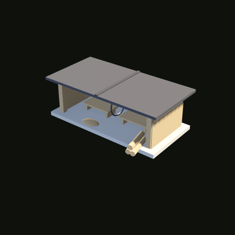 | **Aserradero** | 2×1 | 80 oro · 50 madera | 2 | 6 madera / 12s |
| 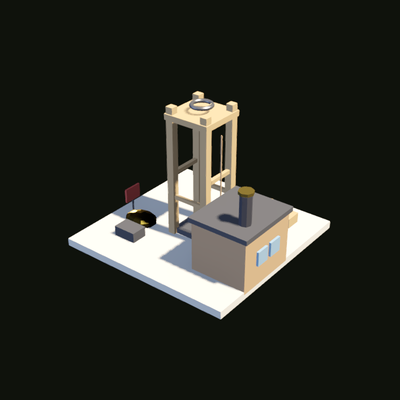 | **Mina de oro** | 2×2 | 120 oro · 80 madera | 3 | 8 oro / 12s |
| 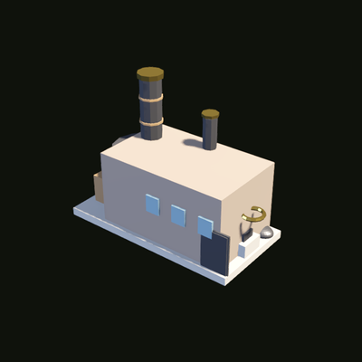 | **Fundición** | 2×1 | 200 oro · 120 madera | 3 | 5 acero / 15s |
| 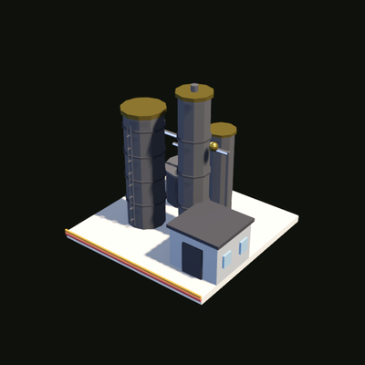 | **Refinería** | 2×2 | 300 oro · 150 acero · 100 madera | 4 | 4 petróleo / 18s |

**La Fundición desbloquea el acero y la era 2. La Refinería desbloquea el petróleo y
la era 3.** Por eso ninguna de las dos cuesta el recurso que desbloquea.

> ⚠️ **La Refinería solo se puede colocar encima de un pozo de petróleo.** Es el único
> edificio con esa restricción. Si no encuentras un pozo en tu isla, no hay era 3.

### Sostienen la base

| | Edificio | Tamaño | Coste | Gente | Qué hace |
|---|---|---|---|---|---|
| 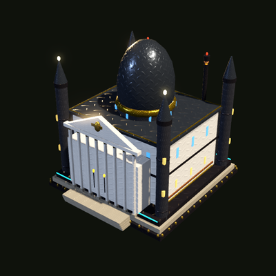 | **Núcleo** | 3×3 | — | 0 | Tu punto de partida. +5 de población. No se puede demoler |
| 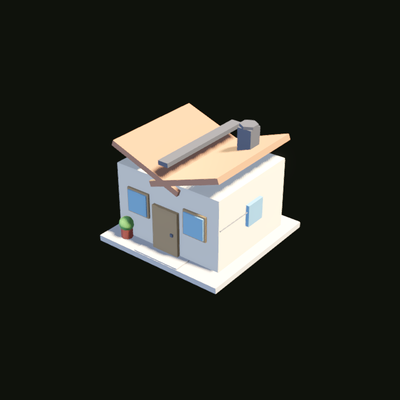 | **Casa** | 1×1 | 50 oro · 30 madera | 0 | +6 de capacidad de población. Máximo 10 |
| 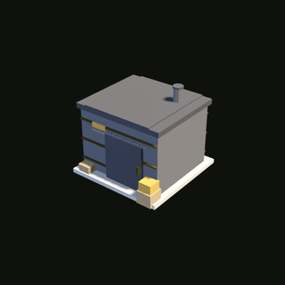 | **Almacén** | 1×1 | 60 oro · 40 madera | 1 | +500 a la bolsa compartida. Máximo 5 |

### Militares

| | Edificio | Tamaño | Coste | Gente | Qué hace |
|---|---|---|---|---|---|
| 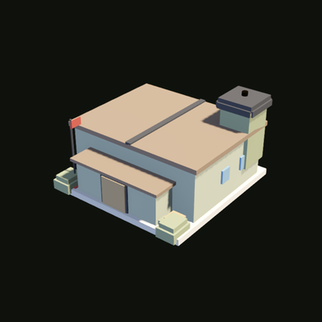 | **Cuartel** | 2×2 | 250 oro · 100 acero · 80 madera | 3 | Entrena unidades. Cada cuartel es una plaza de entrenamiento en paralelo |
| 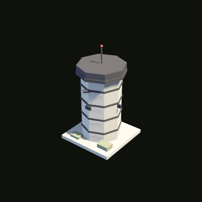 | **Torre** | 1×1 | 150 oro · 60 acero · 20 petróleo · 30 madera | 1 | **Reduce un 15% el daño de la tormenta** (tope 60% entre todas) y **baja 1 dotación de artillería al tablero defensivo** (tope 2 entre todas), fuera del límite de despliegue. Solo cuenta mientras esté operativa: una torre en ruinas ni mitiga ni tripula |
| 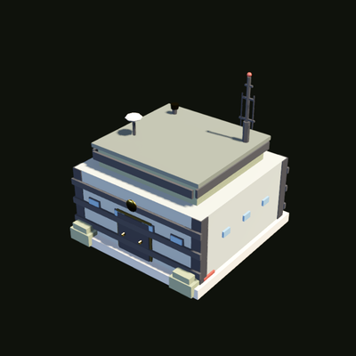 | **Cuartel General** | 2×2 | 500 oro · 300 acero · 200 petróleo · 200 madera | 5 | 10 oro / 20s. **Subirlo a nivel 3 convoca la Auditoría Final**, que es la última prueba de la partida — no la gana por sí solo. Solo uno |

### Decoraciones (suben la moral)

| | Edificio | Coste | Moral |
|---|---|---|---|
| 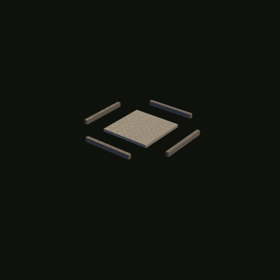 | **Carretera** | 10 oro · 5 madera | +2 |
| 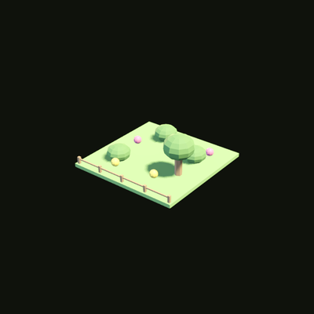 | **Jardín** | 30 oro · 20 madera | +5 |
| 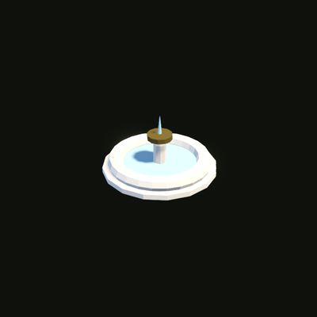 | **Fuente** | 60 oro · 20 acero · 10 madera | +7 |
| 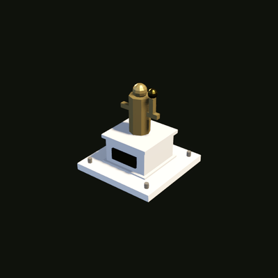 | **Estatua** | 120 oro · 40 acero | +10 |

Las decoraciones no dan moral de golpe: **aceleran su recuperación** (+1 por cada 10
puntos de bonus, por ciclo). No arreglan una base que no puede pagar el consumo;
ayudan a una base que sí puede.

### Qué necesitas antes de poder construir cada cosa

| Edificio | Requiere tener |
|---|---|
| Fundición | Aserradero |
| Cuartel | Fundición + Aserradero |
| Refinería | Fundición |
| Torre | Cuartel |
| Cuartel General | Cuartel + Refinería |

### Límites

Aserradero 5 · Mina de oro 4 · Fundición 3 · Refinería 2 · Almacén 5 · Cuartel 3 ·
Torre 6 · Casa 10 · Estatua 5 · Fuente 5 · **Cuartel General 1** · Jardín y
carretera sin límite.

---

## 6. Los procesos manuales

Además de producir sola, casi cada fábrica tiene **recetas que lanzas a mano** desde
su panel. Conviertes unos recursos en otros con margen. Es la forma de desatascarte
cuando te falta algo concreto.

| Dónde | Receta | Metes | Sacas | Tarda |
|---|---|---|---|---|
| Núcleo | Tablones | 20 madera | 35 madera | 30s |
| Núcleo | Chapa de hierro | 20 acero | 30 acero | 45s |
| Núcleo | **Tuberías** | 15 acero · 10 madera | **60 oro** | 60s |
| Aserradero | Madera refinada | 15 madera | 25 madera · 5 oro | 30s |
| Aserradero | **Carbón vegetal** | 25 madera | **12 acero** | 25s |
| Mina de oro | Minería profunda | 10 acero | 35 oro | 35s |
| Mina de oro | Extracción de gemas | 20 oro · 5 acero | 60 oro | 60s |
| Fundición | Aleación | 20 acero · 10 madera | 45 acero | 40s |
| Fundición | Placas de blindaje | 30 acero | 15 acero · 20 oro | 45s |
| Refinería | Destilación | 15 petróleo | 25 petróleo | 30s |
| Refinería | Procesado químico | 20 petróleo · 10 acero | 18 petróleo · 25 oro | 50s |

> **Dos que conviene conocer:** el **carbón vegetal** del aserradero te da acero sin
> tener Fundición, y las **tuberías** del núcleo son la mejor conversión a oro del
> juego.

---

## 7. El mercado — la Bolsa Imperial

Compras y vendes madera, acero y petróleo **a cambio de oro**. El oro no se compra:
es la moneda.

Los precios flotan. Base: madera 3, acero 8, petróleo 12 oro por unidad, con un
**30% de diferencia entre lo que pagas al comprar y lo que cobras al vender**.
Comprar sube el precio, vender lo baja, y con el tiempo vuelve a su sitio. Se mueve
entre ×0,5 y ×2,5 del precio base.

**Hacer 10 operaciones desbloquea el hito Mercader.**

---

## 8. La tecnología

15 tecnologías en 3 ramas (Industrial, Militar y Logística), 5 niveles cada una en
línea: para la tercera necesitas la segunda.

Cuestan **recursos** y tiempo, y **solo puedes investigar una a la vez**. Los bonos
son permanentes: más producción, más almacenamiento, menos consumo, mejor moral o
construcción más rápida.

---

## 9. El ejército y el combate

El Cuartel entrena tres tipos de unidad. **Cada cuartel entrena una unidad a la vez**;
si quieres dos en paralelo, necesitas dos cuarteles.

| Unidad | Era | Coste | Tarda | Sueldo | Poder |
|---|---|---|---|---|---|
| **Infantería** | 1 | 40 oro · 20 madera | 20s | 1 oro | 10 |
| **Artillería** | 2 | 80 oro · 30 acero | 35s | 2 oro | 28 |
| **Vehículo** | 3 | 140 oro · 60 acero · 30 petróleo | 55s | 4 oro | 65 |

**Capacidad del ejército: 3 + 8 por cada cuartel.** Las unidades entrenándose también
ocupan plaza.

> ⚠️ **El sueldo se cobra cada 30 segundos, solo en oro.** Si no te llega, te vacía el
> oro que tengas y te avisa. Y si el impago se mantiene, **la tropa deserta**: se va
> primero la unidad más cara, que es justo la que más te costó. Un ejército grande sin
> economía detrás no solo te deja sin oro para todo lo demás: se disuelve solo.

### En el tablero

El combate es por turnos en un tablero **8×8**, hasta **6 unidades por bando**.

| | Vida | Ataque | Defensa | Movimiento | Alcance | Iniciativa |
|---|---|---|---|---|---|---|
| Infantería | 30 | 8 | 2 | 3 | 1 | 5 |
| Artillería | 22 | 14 | 1 | 1 | **2 a 3** | 3 |
| Vehículo | 60 | 12 | 5 | 4 | 1 | 4 |

Reglas que hay que saber:
- **Una unidad puede moverse y luego atacar**, pero no moverse dos veces. Atacar
  termina su turno.
- **La artillería no puede disparar a un enemigo pegado a ella** (alcance mínimo 2).
  Si dejas que se te acerquen, no sirve.
- **Defender duplica la defensa** hasta tu siguiente turno.
- **El orden lo marca la iniciativa**, y **tu moral la modifica**: con la moral al
  máximo tus unidades actúan antes y pegan un 15% más fuerte; con la moral por los
  suelos, al revés.
- Si se agotan las 20 rondas, **gana quien tenga más vida total sumada. El empate lo
  pierdes tú.**

> **La moral de tu ciudad se captura al empezar la batalla y no cambia durante ella.**
> Sales a pelear con el ánimo que tenía tu pueblo al despedirte.

### Las expediciones (escaramuzas)

Desde el botón **Escaramuzas** eliges qué unidades salen y las mandas fuera de la
isla. Eso no es una batalla: es una **campaña de varios combates encadenados** de la
que no se vuelve hasta el final.

**Cómo funciona el mapa.** Al salir se genera un mapa por capas: un nodo de entrada
tranquilo, luego entre **4 y 6 capas de 2 o 3 nodos** cada una, y un jefe solo al
final. Tú eliges la ruta, nodo a nodo. Cada nodo lleva un **riesgo** (bajo, medio o
alto) que sube a la vez la dureza del enemigo **y el botín**: el camino peligroso es
una apuesta, no un castigo. Elijas lo que elijas, **desde cualquier nodo se puede
llegar al jefe**; no hay callejones sin salida.

**Las mejoras entre nodos.** Al ganar un nodo que no sea el jefe te ofrecen **3
cartas** y eliges una: más ataque, más defensa, más movimiento, más iniciativa o
curar. A veces la carta apunta a un solo tipo de unidad y entonces **vale el doble**.
Solo te ofrecen cartas que sirvan de algo — una estación de curas no aparece si
nadie está herido. **Mientras haya carta pendiente no puedes elegir ruta**: primero
la carta, luego el camino.

> Las mejoras **duran lo que dure la expedición** y se pierden al volver. No hay
> progresión entre campañas: cada salida empieza de cero.

**El desgaste no se cura.** Las unidades llegan al siguiente nodo con las heridas
del anterior. **Nada se cura entre nodos** salvo que te toque la carta de curación;
la vida solo se recupera al volver a casa.

> ⚠️ **Las bajas no vuelven.** Una unidad que cae en expedición está muerta: ninguna
> carta la resucita y desaparece de tu ejército al liquidar la campaña. Las bajas
> también **te bajan la moral** al volver (−3 por cada una, frente a +8 por ganar),
> así que una victoria muy cara puede dejar al pueblo peor que antes de salir.

**Lo que se queda en casa defiende.** Las unidades que están fuera **no cuentan como
guarnición**. Si la tormenta trae el **Diezmo** mientras tu columna está de campaña,
lo defiende únicamente quien se quedó, más las dotaciones de las torres en pie. Si no
se quedó nadie, no hay defensa. Ese es el verdadero coste de salir: **decidir cuánto
ejército te atreves a dejar fuera de casa.**

> Si el Diezmo cae mientras estás en el tablero de la expedición, la defensa **se
> resuelve sola**, sin tablero, y te llega solo el aviso con el resultado. El juego no
> te quita la partida de las manos para meterte en otra.

**Volver.** Puedes **abandonar** en cualquier momento desde el mapa: te llevas el
botín acumulado y los supervivientes. Retirarse con lo ganado es una opción de
verdad, no una derrota. El botín base por nodo son **60 oro y 30 madera**,
multiplicados por profundidad, era y riesgo — y el jefe casi lo dobla.

Si guardas con una campaña en marcha, al cargar la partida **vuelves al mapa en el
nodo donde estabas**. El tablero de un combate a medias no se guarda.

---

## 10. La Tormenta y el Diezmo

La Tormenta es el reloj de la partida. **Se arma con la primera Fundición** (la era 1
es tranquila: todavía no sales en el libro) y la primera llega **unos diez minutos
después**. A partir de ahí vuelve cada **6 a 10 minutos**, al azar y sin contador en
pantalla: lo que sí es siempre igual es el procedimiento.

| Fase | Dura | Qué pasa |
|---|---|---|
| **Aviso** | 45 s | Ceniza en el horizonte. **No cuesta nada**: es la ventana para gastar, reparar y traer a la tropa a casa. Uno de cada cuatro avisos se disuelve en nada, pero la siguiente llega con **+1 de severidad** |
| **Ceniza** | 60 s | Producción **a la mitad** y la moral empieza a sangrar |
| **Tormenta** | 60 s | Producción **al 15%**, la moral sangra el triple y **se rompen edificios**. Los procesos y entrenamientos que sigan en curso se pierden |
| **Diezmo** | lo que dure la pelea | Llegan los Tasadores a cobrar |

**La severidad** (1 a 5, no se ve) sube con la era y con lo que produces: 1, +1 por era
por encima de la primera, +1 por cada 6 edificios productores, y +1 si hubo una falsa
alarma antes. Cada punto de severidad cuesta **unos 12 puntos de moral** por tormenta:
una de severidad 1 se nota y se recupera en un par de minutos; una de 5 se lleva 60.

**Qué rompe, y en qué orden.** Primero torres, cuarteles y decoraciones; después casas;
los edificios de producción solo a partir de severidad 4, y **nunca el último aserradero
ni la última mina en pie**. Cada torre en pie resta un 15% al daño (tope 60%). Un
edificio a cero queda **en ruinas**: no produce hasta que lo repares (clic → REPARAR).

### El Diezmo

Lo pelea en el tablero **quien esté en casa**: tu guarnición (hasta 6) más **una
dotación de artillería por torre en pie** (tope 2). Si ganas, **no se llevan nada**.

Si pierdes, o no hay nadie, se llevan **un porcentaje de lo almacenado** (del 17% al 37%
según la severidad). Desde la **segunda** visita hay además una **cuota mínima**: si lo
almacenado no la cubre, embargan decoraciones y edificios militares (quedan en ruinas) y,
si aún falta, se llevan obreros. Nunca el Núcleo ni el último habitante. La primera
visita es un alta en el libro: solo su porcentaje.

**La escolta** son 3 unidades más una por punto de severidad por encima de 1 (dos tercios
infantería, un tercio artillería), y crece un 15% **por cada Diezmo que les echas** (tope:
el tablero, 6). Pagar no la engorda; echarlos sí.

**Qué guarnición gana** (medido con la IA a los dos lados, moral 50, que es peor de lo que
juega una persona):

| En casa | Sin torres | Con dos torres en pie |
|---|---|---|
| 3 infantes | pierde siempre | gana hasta severidad 3 |
| 3 infantes + 2 artillerías | gana hasta severidad 3 | **gana siempre** |
| 3 infantes + 3 artillerías | gana siempre | gana siempre |
| 3 blindados | gana hasta severidad 3 | gana siempre |

Tras unos cuantos Diezmos echados la escolta llega al tope (4 infantes y 2 cañones) sea
cual sea la severidad: cuenta como la columna de severidad 4-5 de la tabla.

> ⚠️ **Tres infantes solos pierden incluso contra la escolta más pequeña.** La guarnición
> que recomienda el panel es de cinco, dos de ellas artillería.

---

## 11. El camino a la victoria

Nueve hitos. El último **no** es ganar: es que te convoquen a la prueba final.

| # | Hito | Cómo se consigue |
|---|---|---|
| 1 | Pionero | Construir el primer Aserradero |
| 2 | Prospector | Construir la primera Mina de oro |
| 3 | Acumulador | Construir el primer Almacén |
| 4 | Industrial | Construir la Fundición → **era 2** |
| 5 | Barón del petróleo | Construir la Refinería → **era 3** |
| 6 | Mercader | Completar 10 operaciones de mercado |
| 7 | Comandante | Tener 1 Cuartel y 2 Torres |
| 8 | General | Construir el Cuartel General |
| 9 | **Auditoría Final** | **Subir el Cuartel General a nivel 3** → convoca a la Regencia. Ganar es **sobrevivirla**, ver abajo |

Subir el Cuartel General cuesta aparte:

| Nivel | Coste |
|---|---|
| 2 | 800 oro · 500 acero · 300 petróleo · 400 madera |
| 3 | 1.500 oro · 800 acero · 500 petróleo · 700 madera |

### Orden recomendado, paso a paso

Es el mismo orden que sigue el panel **¿QUÉ HACER?** (en `MENÚ`): el panel dice en
cada momento el siguiente paso, por qué, y qué te falta para darlo. Si algo lo haría
imposible (no hay oro para comer, faltan obreros, no cabe en la bolsa, algo que da de
comer está en ruinas) te pide eso antes.

1. **Aserradero**, pegado a un bosque — lo primero, siempre.
2. **Mina de oro**, pegada a una veta.
3. **Una casa** — necesitas gente para atender lo que construyas.
4. **Segundo aserradero** — tu gente come madera; adelántate.
5. **Almacén** — ⚠️ ojo, lee la nota de la sección 12 antes de ponerlo.
6. **Fundición**, pegada a un hierro — entras en la era 2, se desbloquea el acero **y se
   arma la Tormenta**: la primera llega unos diez minutos después.
7. **Cuartel** y **guarnición**: cinco unidades en casa, dos de ellas artillería. Tres
   infantes solos pierden incluso el Diezmo más pequeño.
8. **Refinería, encima de un pozo** — era 3, petróleo.
9. **Dos Torres** — cierran el hito Comandante, mitigan la Tormenta y bajan dotaciones al
   tablero del Diezmo.
10. **Cuartel General** — y a partir de aquí acumulas para las dos subidas.
11. **HQ nivel 2**, y **seis blindados** en casa.
12. **HQ nivel 3** — con esto **convocas la Auditoría Final**. Cuesta 3.500, exactamente
    la bolsa máxima sin tecnología: investiga Logística 1-2 e Industria 1-2 (+500) para
    tener holgura, o tendrás que cuadrar los cuatro recursos al céntimo mientras tu
    gente come. No lo subas hasta tener el ejército hecho y las torres reparadas: a
    partir de ahí ya no se entrena nada.

Por el camino, **10 operaciones de mercado** en cualquier momento.

### La Auditoría Final

Subir el Cuartel General a nivel 3 **no gana la partida**. Convoca a la Regencia: el
Imperio manda a sus auditores a comprobar en persona si lo que has construido merece
seguir en pie. **Ganar es sobrevivir a esa visita.**

**Qué es.** Un asedio de **3 a 5 oleadas seguidas** contra tu base. No son batallas
sueltas: son una sola noche partida en asaltos. Cuando lo convocas, todavía no baja
nadie — el asedio empieza **cuando tú pulsas el botón** en el panel de Escaramuzas.
Ese margen es para que llegues preparado.

**Cómo se afronta.** Tres cosas que conviene saber antes de convocarla:

1. **No hay refuerzos.** En cuanto empieza el asedio **no se entrena ni se reemplaza
   nada**. Peleas todas las oleadas con el ejército que tuvieras en ese momento.
2. **El desgaste se arrastra de oleada en oleada.** Las unidades **no se curan entre
   oleadas**: la que sale tocada de la primera entra tocada en la segunda. Esa, y no
   que el enemigo escale, es la verdadera dificultad.
3. **Las torres tripulan, pero no resucitan.** Cada oleada vuelve a bajar las
   dotaciones de las torres que sigan en pie, descontando las que ya cayeron. Una
   torre no se cansa; una dotación muerta no se repone.

Las oleadas **crecen**: empiezan en 3 unidades y suman 1 por oleada hasta llenar el
tablero, con artillería desde la primera, blindados desde la segunda y un vehículo
extra en la última. Cuando ya no caben más cuerpos, lo único que sigue subiendo es la
dureza de cada uno.

> ⚠️ **Prepárate antes de convocar.** Repara las torres, paga los sueldos para que
> nadie deserte, sube la moral (que te da iniciativa y daño) y **trae a todo el mundo
> de vuelta de las expediciones**: quien esté de campaña no defiende.

**Si la pierdes no se acaba la partida.** No hay pantalla de derrota. Te cobran el
Diezmo más caro posible y la ciudad queda hecha trizas, pero sigues jugando: cuando
vuelvas a tener **3 unidades en pie** puedes **volver a convocar** la Auditoría. Cada
convocatoria es una noche distinta — el asedio se sortea de nuevo, así que recargar
la partida no sirve para buscar uno más fácil.

**Si la ganas, se acabó la Tormenta.** Sobrevivir a la última oleada **detiene el
ciclo de la tormenta para siempre**: el cielo se despeja, dejan de caer cenizas y no
vuelve a haber Diezmo. Primero se calla el mundo y después sale la pantalla de
victoria. Esa es la Victoria Imperial.

---

## 12. Las cuatro fases (qué se enciende y cuándo)

Esto no se ve en pantalla pero gobierna toda la dificultad. El juego se endurece por
tramos, y **cada tramo lo activas tú al construir algo**.

| Fase | La activa | Qué cambia |
|---|---|---|
| **Fundación** | Inicio | **Ni consumo ni crecimiento.** Construyes libre, sin presión |
| **Asentamiento** | Primer **Aserradero** | Empieza el consumo, pero suave: cada 60s. La moral todavía no se aplica |
| **Economía** | Primera **Mina de oro** | **La moral empieza a contar de verdad** |
| **Supervivencia** | Primer **Almacén** | Consumo cada 30s, castigo de moral de −3 a **−8**, y **empiezan los eventos aleatorios** |
| **Expansión** | **Fundición** (era 2) | Ritmo completo, y **se arma la Tormenta** |

> ⚠️ **El Almacén es el interruptor de la dificultad.** Es el edificio más barato de la
> lista y parece inofensivo, pero al colocarlo **duplicas la frecuencia del consumo,
> casi triplicas el castigo de moral y despiertas los eventos aleatorios**. No lo
> pongas hasta tener dos aserraderos y una mina funcionando.

### Eventos aleatorios

A partir de Supervivencia, cada 2-5 minutos pasa algo:

| Evento | Efecto |
|---|---|
| Tormenta | Pierdes 20-50 madera |
| Hallazgo | Ganas 30-80 de un recurso al azar |
| Accidente minero | −1 población, −15 moral |
| Caravana | Ganas 50-120 oro |
| Festival | +20 moral |
| Peste | −25 moral |
| Buena cosecha | Ganas 40-80 madera |
| Bandidos | Pierdes 30-80 oro, −10 moral |

---

## 13. Modo de pruebas: todo en segundos

`GameConfig.dev_mode` está **activo por defecto** (`scripts/services/GameConfig.gd`).
Con él, una partida entera se juega en minutos en vez de horas.

| Qué | Normal | En pruebas |
|---|---|---|
| **Construir cualquier edificio** | 3 a 30s | **1s fijo** |
| **Cualquier ciclo de producción** | 12 a 20s | **2s fijo** |
| Consumo de la gente (fase temprana) | 60s | 6s |
| Consumo de la gente (fase normal) | 30s | 3s |
| Crecimiento de población | 40s / 20s | 4s / 2s |
| Sueldo del ejército | 30s | 3s |
| Entrenar infantería | 20s | 2s |
| Entrenar artillería | 35s | 3,5s |
| Entrenar vehículo | 55s | 5,5s |
| Procesos manuales | 25 a 60s | 2,5 a 6s |
| Eventos aleatorios | cada 120-300s | cada 15-30s |

La regla general es **la décima parte, con un mínimo de 1 segundo**; construcción y
producción son valores fijos.

> ⚠️ **Lo que se acelera no es solo lo bueno.** El consumo también corre 10 veces más
> rápido, así que una base con mucha población y poca producción se queda sin oro en
> segundos. Si vas a dejar la partida quieta para mirar algo, hazlo con reservas.

Para desactivarlo y jugar con los tiempos reales, pon `dev_mode = false` en
`scripts/services/GameConfig.gd`.

### Empezar una isla nueva

**Desde el juego:** `☰` → `AJUSTES` → `Nueva partida`. Pide confirmación.

**Borrando la partida a mano:** la partida vive en un único JSON, sin base de datos ni
nada en la nube. En Windows:

```
%APPDATA%\Godot\app_userdata\Tormenta Imperial\save_game.json
```

Bórralo y al abrir el juego tendrás una isla nueva generada desde cero.

El guardado en la nube (Supabase) está implementado pero **desconectado a propósito**:
hoy todo es local.
