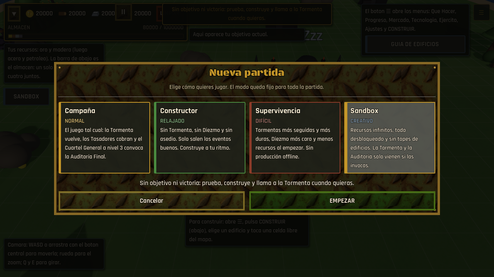
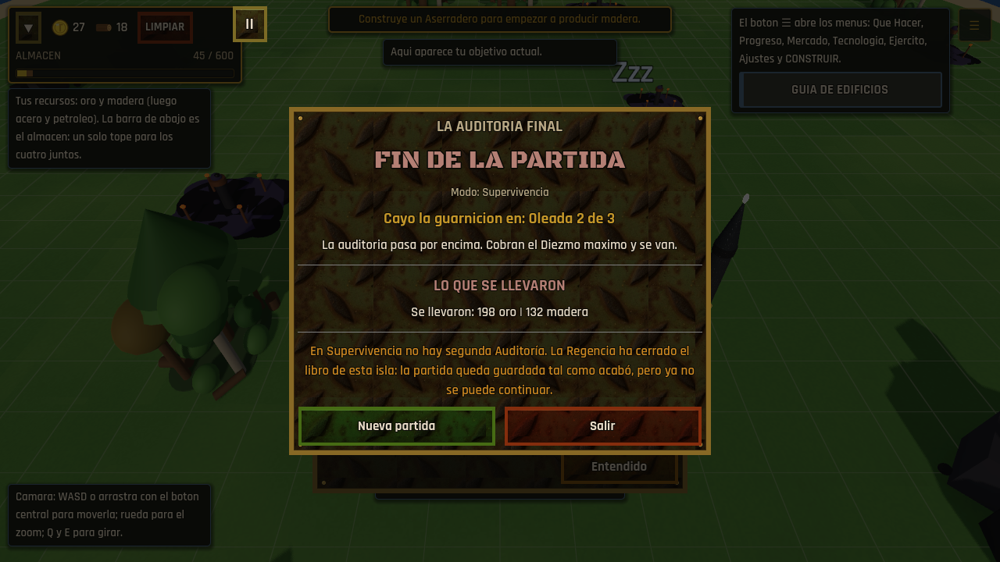
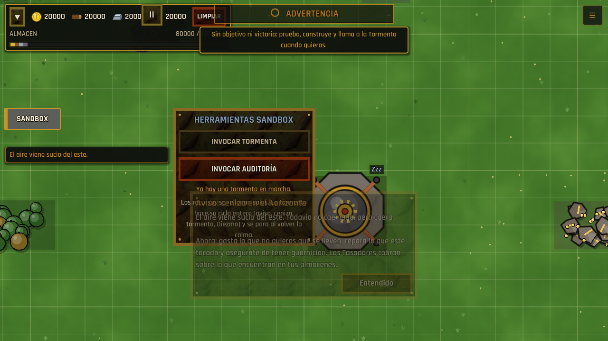

# Modos de juego

Cuatro maneras de jugar la misma isla. Se elige al empezar una partida nueva y
queda fija hasta la siguiente: no se cambia a mitad.

| Modo | Etiqueta | En una línea |
|---|---|---|
| **Campaña** | Normal | El juego de siempre. Modo por defecto; todo guardado anterior a los modos carga como Campaña. |
| **Constructor** | Relajado | Sin Tormenta, sin Diezmo, sin asedio. El Cuartel General a nivel 3 gana directamente. |
| **Supervivencia** | Difícil | Tormentas más seguidas y más duras, Diezmo más caro, menos recursos, sin progreso offline y una sola Auditoría. |
| **Sandbox** | Creativo | Todo abierto, recursos que no se acaban, la Tormenta y la Auditoría solo cuando se invocan. Sin victoria. |



## 1. Reglas de cada modo

Los valores salen de `GameConfig.game_mode_rules`. Lo que un modo no lista lo
hereda de Campaña.

| Regla (clave) | Campaña | Constructor | Supervivencia | Sandbox |
|---|---|---|---|---|
| Reloj de la Tormenta (`storm`) | sí | **no** | sí | **no** (solo invocada) |
| Diezmo (`tithe`) | sí | **no** | sí | sí, si se invoca la tormenta |
| HQ nv.3 convoca la Auditoría (`audit_on_capstone`) | sí | **no** | sí | **no** (solo invocada) |
| HQ nv.3 gana sin asedio (`capstone_wins`) | no | **sí** | no | no |
| Hay victoria (`victory`) | sí | sí | sí | **no** |
| Reconvocar la Auditoría perdida (`resummon`) | sí | — | **no: la partida termina** | sí (invocar otra) |
| Progreso offline (`offline`) | sí | sí | **no** | sí |
| Eventos aleatorios (`random_events`) | sí | sí | sí | **no** |
| Eventos de peligro (`danger_events`) | sí | **no** | sí | — |
| Recursos infinitos (`infinite_resources`) | no | no | no | **sí** |
| Todo desbloqueado, sin topes ni requisitos (`all_unlocked`) | no | no | no | **sí** |
| Herramientas Sandbox (`sandbox_tools`) | no | no | no | **sí** |
| Calma entre tormentas (`storm_interval_mult`) | ×1 | — | **×0,6** | ×1 |
| Severidad extra (`storm_severity_bonus`) | +0 | — | **+1** (también la primera) | +0 |
| Daño de tormenta (`storm_damage_mult`) | ×1 | — | **×1,25** | ×1 |
| Deuda del Diezmo (`tithe_mult`) | ×1 | — | **×1,5** | ×1 |
| Recursos al empezar | 300 oro, 200 madera | igual | **×0,75** (225 / 150) | **20 000 de cada** |
| Consejos del tutorial ocultos (`hidden_tips`) | ninguno | tormenta, ceniza, Diezmo, ruinas, Auditoría | ninguno | Auditoría |

### Decisiones

- **Constructor y los eventos.** Se quedan los buenos (hallazgo, caravana,
  festival, buena cosecha) y se quitan los cuatro de categoría `danger`
  (tormenta menor, accidente minero, plaga, bandidos). Un modo "relajado" que
  te roba el oro cada cinco minutos no es relajado; uno sin ningún evento es
  plano. El ejército, las escaramuzas y las expediciones siguen, por botín.
- **Constructor gana en el acto.** El hito `hq_max` llama a `_trigger_victory()`
  sin Auditoría. La pantalla de victoria usa textos propios ("OBRA TERMINADA")
  que no hablan de la Tormenta.
- **Supervivencia pierde de verdad.** Perder la Auditoría cobra lo mismo que en
  Campaña (Diezmo y tormenta máximos) y además marca la partida como terminada
  (`GameMode.finish_run("defeat")`, señal `run_ended`). El guardado **se
  conserva**, escrito una última vez con `"result": "defeat"`, y queda **sellado**:
  GameManager ya no lo vuelve a escribir. Al cargarlo sale otra vez la pantalla
  de fin (sin "Reconstruir" y sin cerrar: solo Nueva partida o Salir) y el menú
  principal no ofrece "Continuar". Se prefirió conservarlo a borrarlo porque es
  el registro de cómo acabó, y borrar una partida sin que el jugador lo pida
  no se hace en ninguna otra parte del juego.
- **Supervivencia sigue siendo abrible.** El 75 % de salida (225 oro / 150
  madera) todavía paga Aserradero + Mina de oro (200 / 130), que es la apertura
  que el diseño da por hecha. Hay un test que lo vigila.
- **Sandbox, recursos infinitos.** No se falsea el coste: se cobra como en
  cualquier otro modo y, tras cada gasto, lo que baja de 20 000 se rellena hasta
  20 000 (`ResourceManager._top_up`). La bolsa compartida sube a 1 000 000. Así
  el HUD, el mercado y un Diezmo invocado ven el mismo flujo de siempre.
- **Sandbox, todo abierto.** Era 3 desde el principio (acero y petróleo
  desbloqueados), las 15 tecnologías investigadas con sus bonos
  (`TechTreeManager.unlock_all`, solo en partida nueva), sin topes por tipo de
  edificio ni prerrequisitos. Los obreros y los yacimientos siguen mandando:
  hacen falta casas y hay que construir sobre el yacimiento que toca.
- **Sandbox, tormenta a la carta.** `StormManager.invoke_storm()` entra en la
  Advertencia y marca el ciclo como forzado (`StormCycle.forced`): esa
  Advertencia nunca es falsa alarma. Sigue el ciclo entero (ceniza, tormenta,
  Diezmo) y, al volver la calma, el reloj se para solo. Viaja en el guardado.
- **Sandbox, Auditoría a la carta.** `ProgressionManager.invoke_final_audit()` la
  convoca **pendiente**, como la de una partida antigua: se entra con QUE BAJEN
  en Escaramuzas cuando la guarnición esté lista. Ganarla no es victoria ni
  para la Tormenta; perderla cobra como siempre, y se puede invocar otra.
- **Hitos.** Siguen contándose en todos los modos (dan fases y avisos), pero en
  Sandbox no llevan a nada.

## 2. Cómo está hecho

### Una sola fuente de verdad

`scripts/services/GameMode.gd` (`class_name GameMode`, estático, **no** es un
autoload). Guarda dos cosas: el modo en curso (`current`) y si la partida ya
terminó (`run_result`). Todo lo demás son consultas sobre la tabla:

```gdscript
GameMode.storm_enabled()      GameMode.tithe_enabled()     GameMode.audit_enabled()
GameMode.capstone_wins()      GameMode.victory_enabled()   GameMode.resummon_allowed()
GameMode.offline_enabled()    GameMode.random_events_enabled()
GameMode.danger_events_enabled()  GameMode.infinite_resources()  GameMode.all_unlocked()
GameMode.sandbox_tools()      GameMode.storm_interval_mult()  GameMode.storm_severity_bonus()
GameMode.storm_damage_mult()  GameMode.tithe_mult()        GameMode.starting_resources()
GameMode.tip_allowed(tip_id)
```

Ningún servicio compara el modo (`if mode == SURVIVAL`); pregunta la regla. No
es un autoload a propósito: GameConfig (autoload nº 2) lo lee desde sus getters
y no puede depender del orden de carga.

### Dónde se aplica cada regla

| Regla | Dónde |
|---|---|
| Intervalos, severidad, daño y deuda | Getters de `GameConfig` (`get_storm_interval_*`, `get_storm_first_interval`, `get_storm_severity_bonus`, `get_storm_damage`, `get_tithe_debt`). `StormCycle` sigue puro: solo lee GameConfig. |
| Reloj de la Tormenta, Diezmo, tormenta invocada | `StormManager` (`is_armed`, `_process`, `_begin_tithe`, `invoke_storm`) |
| HQ nv.3, victoria, reconvocar, fin de partida, Auditoría invocada | `ProgressionManager` (`_complete_milestone`, `_publish_audit`, `_trigger_victory`, `can_resummon_final_audit`, `invoke_final_audit`) |
| Eventos | `RandomEventManager.get_active_event_pool()` |
| Recursos de salida, desbloqueos, relleno | `ResourceManager.reset()` / `_top_up()`; bolsa en `GameConfig.get_storage_cap` |
| Topes y requisitos | `GameConfig.get_building_limit` / `get_prerequisites` |
| Tecnologías | `TechTreeManager.unlock_all()`, llamado desde `GameManager._new_game()` |
| Offline, guardado sellado | `GameManager._load_game()` / `_can_write()` |
| Consejos | `TutorialManager.offer_tip()` |

### Guardado

```json
"game_mode": {"mode": "survival", "result": ""}
```

- Se escribe en `_write_save()` y se lee **lo primero** en `_load_game()`, antes
  que los servicios (sus cargas leen reglas).
- Sin la clave, o con un modo desconocido: Campaña en curso.
- Estado persistente (checklist de CLAUDE.md): `GameMode.begin_run()` es su
  `reset()` y se llama en los tres sitios de partida nueva — `_new_game()`,
  `clear_save()` y `clear_save_and_reload_from()` (este último toma el modo del
  guardado que va a cargar). No reembolsa ni avisa de nada.
- `StormManager` guarda además `on_demand` y `StormCycle` guarda `forced`.

### Nueva partida

Toda entrada ("Nueva partida" del menú principal, Ajustes, la victoria, el fin
de Supervivencia, y Pausa → Menú principal → Nueva partida) pasa por
`GameManager.request_new_game(ask_confirm)`, que abre `NewGameDialog`
(`scripts/ui/NewGameDialog.gd`, capa 40, procesa en pausa):

1. Cuatro tarjetas (nombre, dificultad, descripción) y el objetivo del modo
   elegido. Cada tarjeta es un botón de 150 px de alto como mínimo. La rejilla
   va a 4 columnas desde 900 px de ancho de tarjeta (1280x800, 1024x768), a 2
   desde 520 y a 1 en un móvil en vertical, con desplazamiento si no cabe.
2. Solo si hay algo que perder: "Se borrará tu partida actual (Campaña) y
   empezará una nueva en modo X".

Confirmar llama a `GameManager.start_new_game(mode)` → `GameMode.begin_run(mode)`
→ `clear_save()` → recarga, y la escena nueva arranca `_new_game()` con las
reglas del modo. Sustituye al `ConfirmationDialog` con el tema por defecto de
Godot que salía en el emulador de Android.

### Qué ve el jugador

- **Pausa:** "Modo: X" bajo el título. **Menú principal:** "Partida en curso: X"
  bajo Continuar.
- **Objetivos (Qué hacer):** empieza por "MODO: X" y lo que pide el modo. En
  Sandbox la pista de arriba dice el objetivo del modo en vez de los pasos de
  campaña.
- **Victoria:** una fila "Modo"; Constructor con sus propios textos.
- **Fin de Supervivencia:** `AuditDefeatScreen` en su variante final.
- **Sandbox:** una pestaña SANDBOX en el borde izquierdo (bajo la barra de
  recursos; marca la partida como de pruebas) que abre las herramientas:
  INVOCAR TORMENTA e INVOCAR AUDITORÍA, apagados mientras ya hay una en
  marcha (`scripts/ui/SandboxPanel.gd`, en `Main.tscn` y `Main2D.tscn`).

Todo funciona igual en la vista 3D y en la 2D: ninguna pieza depende de la
cámara ni del placer.




## 3. Cómo añadir un modo

1. `GameMode.gd`: un valor nuevo en `Mode`, su clave en `KEYS` (texto estable:
   es lo que se guarda) y su sitio en `ORDER` (el orden del selector).
2. `GameConfig.game_mode_rules`: una entrada con **solo** lo que cambia respecto
   a Campaña.
3. Si necesita una regla que no existe: una clave nueva en la entrada
   `"campaign"` (con el valor de siempre), una consulta en `GameMode` y la
   pregunta en el servicio que la aplica. Nunca `if GameMode.current == ...`.
4. `Tr.gd`, en los dos idiomas, bajo `# ── modos-de-juego ──`:
   `MODE_<CLAVE>_NAME`, `_TAG`, `_DESC`, `_GOAL`.
5. `NewGameDialog.mode_color()` si quieres un color propio para su tarjeta.
6. Tests: `tests/modes/` — hay uno que exige los cuatro textos en ES y EN para
   cada modo de `ORDER`.

## 4. Pruebas y capturas

- `tests/modes/test_game_mode_rules.gd` — tabla, guardado del modo, getters.
- `tests/modes/test_game_mode_services.gd` — Tormenta, Diezmo, final de
  partida, Sandbox en los servicios.
- `tests/modes/test_game_mode_save.gd` — GameManager real: el modo en el
  guardado, colonias nuevas por modo, Supervivencia sellada, sin offline.
- `tests/modes/test_game_mode_ui.gd` — selector, pausa, menú principal,
  pestaña Sandbox, victoria de Constructor, fin de Supervivencia.
- `tools/modes_probe.gd` — capturas con ventana (selector y cada modo un
  minuto dentro, en 3D y 2D). Instrucciones en su cabecera; siempre con una
  carpeta de usuario propia en `override.cfg`.
