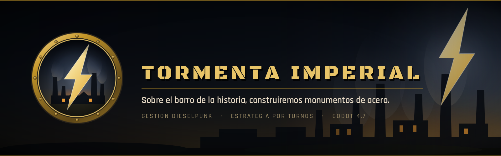
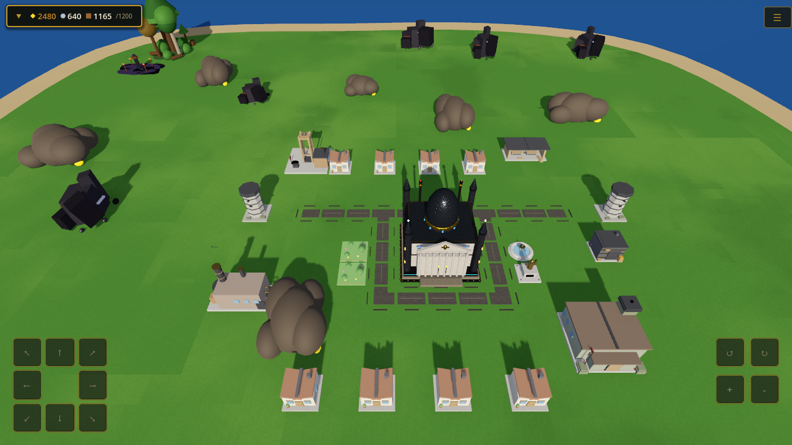
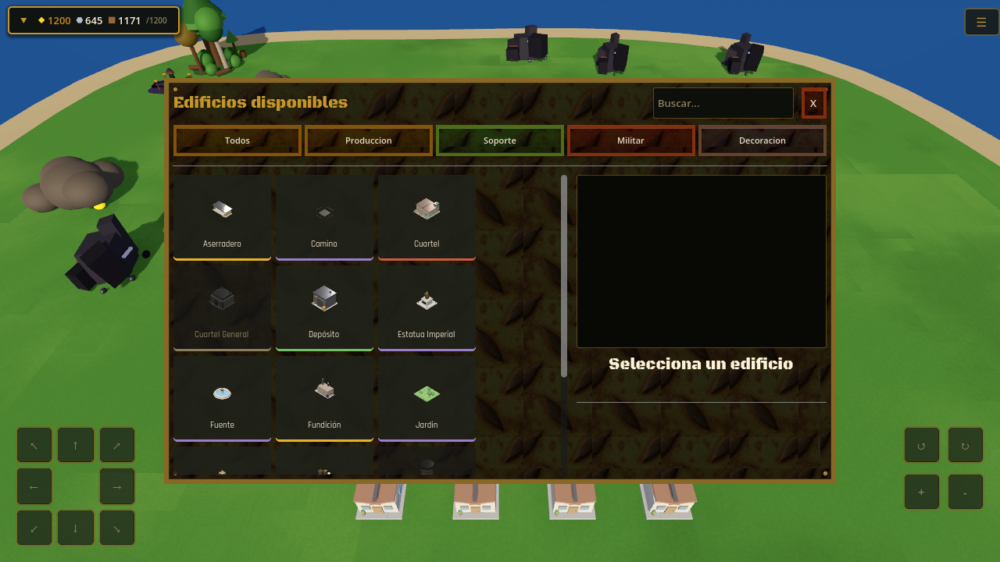
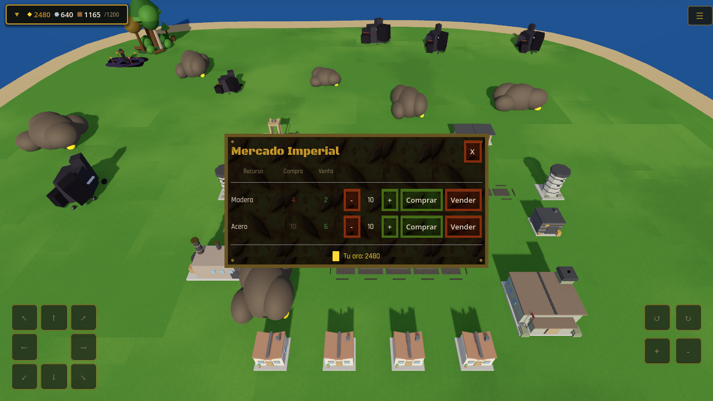
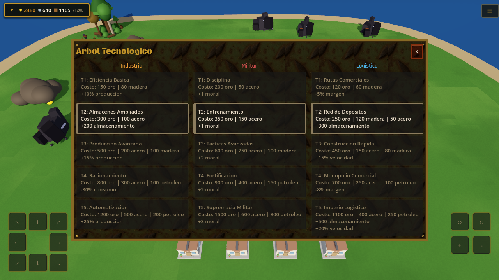
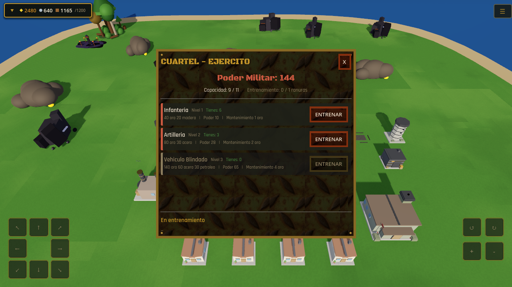

<p align="center">
  
</p>

<p align="center">
  
  
  
  
</p>

<p align="center">
  <strong>Un imperio industrial se levanta sobre una isla de barro. La tormenta ya viene.</strong>
</p>

---

## Qué es

**Tormenta Imperial** es un juego **dieselpunk de gestión de base y estrategia por turnos**, hecho en Godot 4.7.

Llegas a una isla generada proceduralmente con un núcleo, 300 de oro y 200 de madera. A partir de ahí, todo lo que tengas lo habrás construido: aserraderos que muerden el bosque, minas, una fundición que enciende la era del acero, una refinería que abre la del petróleo. Tu gente trabaja, consume y **tiene moral** — y la moral decide si tu imperio produce o se para.

Cuando entrenes un ejército, esas tropas saldrán de tu economía y volverán —o no— a ella. Porque la Tormenta Imperial vuelve: apaga el cielo, rompe lo que construiste y manda a los Tasadores a cobrar el Diezmo. Ese cobro se pelea en un tablero de 8x8 con lo que tengas en casa.

> *"Sobre el barro de la historia, construiremos monumentos de acero."*

## Así se ve

<p align="center">
  
</p>

<p align="center">
  <em>Mitad de campaña: era industrial, 26 habitantes, moral alta y un ejército pequeño ya en pie.</em>
</p>

| | |
|---|---|
|  |  |
| **Construcción** — catálogo filtrable de 14 edificios, con requisitos y coste. | **Mercado Imperial** — compra y venta con precios que flotan según lo que hagas. |
|  |  |
| **Tecnología** — 15 mejoras en tres ramas, cinco escalones cada una. | **Ejército** — entrenamiento por ranuras, poder militar y mantenimiento en oro. |

> Capturas del juego corriendo, generadas por [`tools/showcase_shots.gd`](tools/showcase_shots.gd). No son montajes.

## El bucle

1. **Construye** para producir: cada edificio necesita trabajadores, y los trabajadores necesitan casas.
2. **Sostén a tu gente**: cada habitante consume oro y madera. Si no puedes pagar, la moral cae y con ella la producción.
3. **Comercia** en el Mercado Imperial, con precios que flotan según lo que compres y vendas.
4. **Progresa** por tres eras: Frontera → Industrial → Petróleo. Cada una desbloquea un recurso y con él media docena de decisiones nuevas.
5. **Investiga** quince tecnologías en tres ramas, con bonificaciones permanentes.
6. **Entrena un ejército** en el Cuartel — y págale el mantenimiento, todos los turnos, en oro.
7. **Sobrevive** a la Tormenta Imperial: ceniza, edificios en ruinas y el Diezmo, que se paga o se pelea.
8. **Aguanta la Auditoría Final.** Subir el Cuartel General al nivel 3 ya no gana la partida: convoca a la Regencia. De 3 a 5 oleadas seguidas contra la guarnición que tengas en casa, sin reentrenar entre medias. Sobrevivirlas para la Tormenta para siempre — y eso sí es ganar.

## Lo que lo hace distinto

**La moral no es una barra que cuidas: es el sistema que lo conecta todo.** Multiplica tu producción, y también decide la iniciativa de tus unidades en el tablero y lo fuerte que golpean. Las bajas la hunden al volver a casa: una victoria cara puede dejar al pueblo peor que antes de salir. Un imperio desmoralizado reacciona tarde y golpea flojo.

Ningún otro juego del género cruza esas dos mitades. Esa es la apuesta.

## Estado

El **bucle de gestión está completo y es jugable** de principio a fin: economía, población y moral, mercado, árbol tecnológico, ejército, eventos aleatorios, progresión offline y tutorial. Corre sin errores ni warnings, a 144 fps.

El **combate PVE por turnos está en el juego**: tablero de 8x8, orden de iniciativa, mover/atacar/defender/esperar, IA enemiga, el Diezmo peleado en vez de pagado, y la Auditoría Final que cierra la partida. Todo el modelo vive en `scripts/combat/` como objetos puros, sin nodos ni señales, y se prueba en headless con gdUnit4.

| Pieza | Estado |
|---|---|
| Tablero táctico, turnos, IA enemiga (`Encounter`, `CombatAI`, `BattleScreen`) | ✅ en el juego |
| El Diezmo se pelea: guarnición y dotaciones de torre en el tablero | ✅ en el juego |
| Defensa auto-resuelta cuando el tablero ya está ocupado (`AutoResolver`) | ✅ en el juego |
| Auditoría Final: oleadas encadenadas, atrición, perder sin Game Over, reconvocar | ✅ en el juego |
| Expedición roguelike: mapa por semilla, atrición, muerte permanente, draft | ⚙️ modelo, servicio, guardado y tests hechos — **falta la interfaz** |

La expedición es lo único que queda del pilar: `CombatManager` ya sabe lanzarla, encadenarla, guardarla y liquidarla, pero ninguna pantalla la conduce todavía. Detalle técnico en [`docs/15-combat.md`](docs/15-combat.md); especificación en [`specs/001-combate-pve/`](specs/001-combate-pve/).

## Bajo el capó

| | |
|---|---|
| **Motor** | Godot 4.7 (.NET/mono), renderer Forward+ |
| **Lenguaje** | GDScript — 19.200 líneas en 62 scripts, 19 escenas |
| **Arquitectura** | Servicio–señal–componente: 24 autoloads que **solo** se hablan por un `EventBus`. Ningún servicio referencia a otro |
| **Modelos puros** | La lógica de combate y de la Tormenta vive en `scripts/combat/` y `scripts/storm/` como `RefCounted` sin nodos ni señales: devuelven listas de eventos y un servicio las publica. Por eso se prueban enteras en headless |
| **Balance** | Todo valor ajustable vive en `GameConfig.gd`. Cero números mágicos repartidos por el código |
| **Modelos 3D** | 12 de los 14 edificios son GLB; `nucleo` y `road` se generan proceduralmente por `DieselpunkBuildingFactory` (la calzada necesita conocer a sus vecinas) |
| **Guardado** | JSON local con progresión offline de hasta 8 horas |
| **Tests** | gdUnit4 sobre las fórmulas puras de economía y combate |

El proyecto sigue **Spec-Driven Development**: cada pilar pasa por especificación, plan técnico y lista de tareas antes de escribirse. Las reglas que no se negocian están en [`.specify/memory/constitution.md`](.specify/memory/constitution.md).

Documentación por sistema en [`docs/`](docs/INDEX.md) · Guía técnica en [`CLAUDE.md`](CLAUDE.md)

## Estructura

```
tormenta-imperial/
├── scenes/          Main.tscn y una escena por panel de interfaz
├── scripts/
│   ├── services/    Los autoloads: economía, población, mercado, ejército…
│   ├── combat/      Modelos puros del combate: tablero, IA, expedición, Auditoría
│   ├── storm/       Modelo puro del ciclo de la Tormenta
│   ├── buildings/   Colocación y fábrica procedural de modelos
│   ├── ui/          Un script por panel, más tema y disposición
│   ├── grid/        Rejilla de 40x40 celdas
│   ├── map/         Isla y depósitos procedurales
│   └── camera/      Cámara ortográfica a 45°
├── data/buildings/  Los 14 edificios, como recursos .tres
├── assets/          Audio, fuentes, texturas y marca
├── specs/           Especificaciones previas a cada pilar
├── tests/           Suites de gdUnit4 sobre los modelos puros
├── docs/            Documentación por sistema
└── tools/           Utilidades de desarrollo (marca, capturas, texturas, sondas)
```

## Correrlo

Necesitas **Godot 4.7 (.NET)**. No hay proyecto C# ni dependencias externas.

```bash
git clone https://github.com/bryansank/tormenta-imperial.git
cd tormenta-imperial
godot --path . --editor     # y pulsa F5
```

| Acción | PC | Móvil |
|---|---|---|
| Mover cámara | WASD / flechas / arrastrar con botón central | Arrastrar un dedo |
| Zoom | Rueda del ratón | Pellizcar |
| Rotar | Botones en pantalla | Botones en pantalla |

`GameConfig.dev_mode` (activo por defecto) acorta todas las duraciones a 1–2 segundos para probar rápido. Para empezar de cero: **Ajustes → Nueva partida**.

### Utilidades de desarrollo

```bash
# Regenerar la marca tras tocar los SVG (con ventana, NO headless)
godot --path . -s tools/render_brand.gd        # emblema y banner
godot --path . -s tools/render_branding.gd     # key art

# Tests
godot --headless --path . -s addons/gdUnit4/bin/GdUnitCmdTool.gd -a tests
```

---

## Licencia

> **Código disponible, no código abierto.** Este repositorio es público para que el trabajo se pueda **leer, estudiar y evaluar** — no para reutilizarlo.

El código fuente se publica bajo [**PolyForm Strict 1.0.0**](https://polyformproject.org/licenses/strict/1.0.0), una licencia deliberadamente restrictiva.

| Puedes | No puedes |
|---|---|
| Leer y estudiar el código | Redistribuirlo, en fuente o compilado |
| Clonarlo y ejecutarlo en local, para estudio o entretenimiento privado | Crear versiones modificadas, forks o trabajos derivados |
| Citarlo y comentarlo | Usarlo, entero o en parte, con fines comerciales |

Además:

- **Arte, audio, textos y el nombre "Tormenta Imperial"** quedan fuera de esa licencia: **todos los derechos reservados**. Eso incluye el emblema, el banner y el key art de [`assets/branding/`](assets/branding/).
- **Componentes de terceros** —Godot, gdUnit4, Beckett, las fuentes y los assets CC0— conservan sus propias licencias. Están listadas una a una en [THIRD-PARTY-NOTICES.md](THIRD-PARTY-NOTICES.md).

Los términos completos, que son los que mandan, están en [LICENSE](LICENSE).

**¿Necesitas otros términos?** Para uso comercial, educativo o cualquier cosa que la licencia no permita, abre un [issue](https://github.com/bryansank/tormenta-imperial/issues) y lo hablamos. La licencia es estricta por defecto, no por cerrazón.

<p align="center">
  <sub>Copyright © 2026 Bryan Key · Todos los derechos reservados</sub>
</p>
