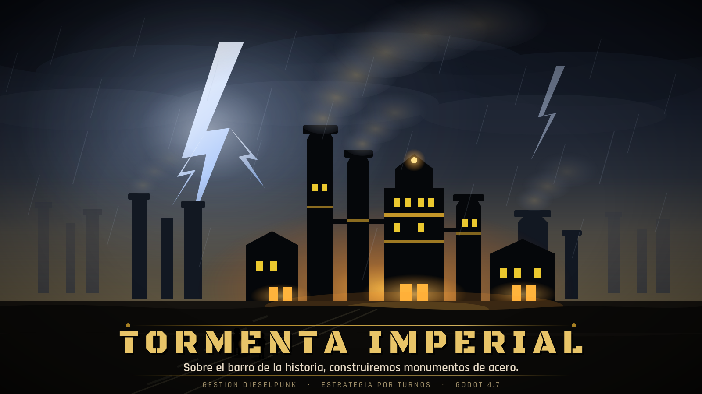

<p align="center">
  
</p>

<p align="center">
  <strong>Un imperio industrial se levanta sobre una isla de barro. La tormenta ya viene.</strong>
</p>

<p align="center">
  
  
  
  
</p>

---

## Qué es

**Tormenta Imperial** es un juego **dieselpunk de gestión de base y estrategia por turnos**.

Llegas a una isla generada proceduralmente con un núcleo, 300 de oro y 200 de madera. A partir de ahí, todo lo que tengas lo habrás construido: aserraderos que muerden el bosque, minas, una fundición que enciende la era del acero, una refinería que abre la del petróleo. Tu gente trabaja, consume y **tiene moral** — y la moral decide si tu imperio produce o se para.

Cuando entrenes un ejército, esas tropas saldrán de tu economía y volverán —o no— a ella.

> *"Sobre el barro de la historia, construiremos monumentos de acero."*

## El bucle

1. **Construye** para producir: cada edificio necesita trabajadores, y los trabajadores necesitan casas.
2. **Sostén a tu gente**: cada habitante consume oro y madera. Si no puedes pagar, la moral cae y con ella la producción.
3. **Comercia** en el Mercado Imperial, con precios que flotan según lo que compres y vendas.
4. **Progresa** por tres eras: Frontera → Industrial → Petróleo. Cada una desbloquea un recurso y con él media docena de decisiones nuevas.
5. **Investiga** quince tecnologías en tres ramas, con bonificaciones permanentes.
6. **Entrena un ejército** en el Cuartel — y págale el mantenimiento, todos los turnos, en oro.
7. **Sobrevive** a tormentas, plagas y bandidos.
8. **Gana** llevando tu Cuartel General al nivel 3.

## Lo que lo hace distinto

**La moral no es una barra que cuidas: es el sistema que lo conecta todo.** Hoy multiplica tu producción. Cuando llegue el combate, decidirá también la iniciativa de tus unidades en el tablero, las bajas la hundirán al volver a casa, y una derrota podrá parar tus fábricas. Un imperio desmoralizado reacciona tarde y golpea flojo.

Ningún otro juego del género cruza esas dos mitades. Esa es la apuesta.

## Estado

El **bucle de gestión está completo y es jugable** de principio a fin: economía, población y moral, mercado, árbol tecnológico, ejército, eventos aleatorios, progresión offline y condiciones de victoria.

El **combate PVE por turnos** es el pilar en construcción. Está enteramente especificado y planificado en [`specs/001-combate-pve/`](specs/001-combate-pve/): expediciones roguelike con mapa ramificado, atrición entre encuentros, muerte permanente, draft de mejoras y un jefe final. Los cimientos (reglas de combate, unidades, servicio de dominio) ya están en el repositorio; falta el tablero.

## Bajo el capó

| | |
|---|---|
| **Motor** | Godot 4.7 (.NET/mono), renderer Forward+ |
| **Lenguaje** | GDScript — 24.000 líneas, 83 scripts, 30 escenas |
| **Arquitectura** | Servicio–señal–componente: 20 autoloads que **solo** se hablan por un `EventBus`. Ningún servicio referencia a otro |
| **Balance** | Todo valor ajustable vive en `GameConfig.gd`. Cero números mágicos repartidos por el código |
| **Modelos 3D** | Generados proceduralmente en tiempo de ejecución por `DieselpunkBuildingFactory` |
| **Guardado** | JSON local con progresión offline de hasta 8 horas |
| **Tests** | gdUnit4 sobre las fórmulas puras de economía y combate |

El proyecto sigue **Spec-Driven Development**: cada pilar pasa por especificación, plan técnico y lista de tareas antes de escribirse. Las reglas que no se negocian están en [`.specify/memory/constitution.md`](.specify/memory/constitution.md).

Documentación por sistema en [`docs/`](docs/INDEX.md) · Guía técnica en [`CLAUDE.md`](CLAUDE.md)

## Correrlo

Necesitas **Godot 4.7 (.NET)**. No hay proyecto C# ni dependencias externas.

```bash
godot --path . --editor     # abre el proyecto
# o pulsa F5 dentro del editor
```

| Acción | PC | Móvil |
|---|---|---|
| Mover cámara | WASD / flechas / arrastrar con botón central | Arrastrar un dedo |
| Zoom | Rueda del ratón | Pellizcar |

`GameConfig.dev_mode` (activo por defecto) acorta todas las duraciones a 1–2 segundos para probar rápido. Para empezar de cero: **Ajustes → Nueva partida**.

## Licencia

**Código disponible, no código abierto.** Este repositorio es público para que el trabajo se pueda leer y estudiar — no para reutilizarlo.

- **Código fuente:** [PolyForm Strict 1.0.0](https://polyformproject.org/licenses/strict/1.0.0). Puedes leerlo y ejecutarlo en local para estudio o entretenimiento privado. **No** puedes redistribuirlo, modificarlo ni usarlo comercialmente.
- **Arte, audio, textos y el nombre "Tormenta Imperial":** todos los derechos reservados.
- **Componentes de terceros** (Godot, gdUnit4, Beckett, fuentes, assets CC0) conservan sus propias licencias — ver [THIRD-PARTY-NOTICES.md](THIRD-PARTY-NOTICES.md).

Términos completos en [LICENSE](LICENSE). ¿Quieres otros términos? Abre un issue.
